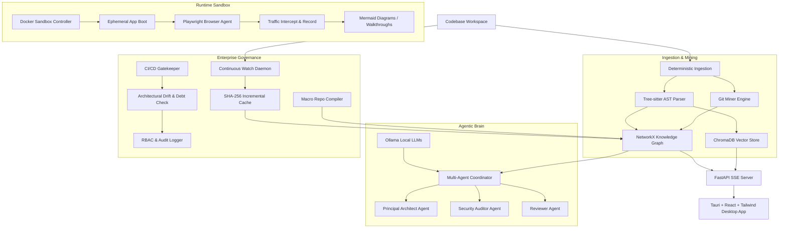

# Repollama 🦙🔍

**Repollama** is a local-first, privacy-focused, enterprise-grade Autonomous Software Intelligence Platform built from the ground up. It empowers developers and architects to analyze, visualize, sandbox, audit, and govern codebases completely offline. 

By combining deterministic Abstract Syntax Tree (AST) parsing, Git history mining, local NetworkX knowledge graphs, a ChromaDB vector store, secure Docker sandboxing, autonomous Playwright agents, a custom LLM Multi-Agent Framework, and continuous CI/CD governance checks, Repollama delivers a comprehensive developer cockpit and staff-level intelligence directly in your terminal and on your desktop.

---

## 🏗️ Platform Architecture

Repollama leverages a highly decoupled, state-of-the-art architecture merging lexical code analysis with dynamic runtime exploration:



---

## 💡 Core Capabilities

### 1. 📂 Phase 1: Repository Intelligence
Repollama builds a deep lexical and semantic understanding of your code without letting a single byte leave your machine:
* **AST Parser**: Leverages `tree-sitter` (supporting Python, JavaScript, and TypeScript/TSX) to map functions, classes, and import scopes.
* **Git Miner**: Connects via `GitPython` to analyze histories, developer ownership patterns, and file churn rates.
* **Knowledge Graph**: Generates a unified code representation using `NetworkX` to trace reference dependencies.
* **Vector Store**: Uses `ChromaDB` for local embedding storage, enabling secure, semantic natural language code search.

### 2. 🐳 Phase 2: Runtime Intelligence
Repollama goes beyond static analysis to see how your application actually behaves at runtime:
* **Docker Sandboxing**: Ephemerally spins up application stacks inside isolated containers using the Python Docker SDK.
* **Playwright Browser Agent**: Automates UI navigation, finding interactive elements, taking screenshots, and recording video walkthroughs (`.webm`).
* **Sequence Tracing**: Intercepts HTTP/XHR traffic during browser actions and dynamically generates Mermaid sequence diagrams mapping API traffic.

### 3. 🧠 Phase 3: Engineering Intelligence
A private, cooperative AI brain orchestrates reviews, documentation, and audits:
* **Multi-Agent Framework**: Coordinates local LLMs (via Ollama) executing roles for a **Principal Architect**, **Security Auditor**, and a self-reflecting **Reviewer Agent**.
* **Technical Debt Auditor**: Ranks files by risk using a metric combining graph coupling, code complexity, and Git churn.
* **Security & Performance Auditor**: Runs AST-based scans for hardcoded secrets, weak cryptography, and runtime performance bottlenecks.
* **Auto-Documentation**: Generates pristine C4 system diagrams, Entity-Relationship Diagrams (ERDs), and comprehensive repository wikis automatically.

### 4. 🛡️ Phase 4: Enterprise Intelligence
Built for team collaboration, scale, and compliance governance:
* **Continuous File System Watcher**: A daemon (`watchdog`) that listens to filesystem changes and surgically patches the knowledge graph.
* **Incremental Hash Cache**: Uses SHA-256 caching to only re-parse files that have changed, ensuring instantaneous graph updates.
* **Macro Compiler**: Merges separate codebases into unified macro-graphs to resolve cross-repository dependency links.
* **CI/CD Gatekeeper**: Enforces strict architectural governance policies via PR checks. Supports RBAC-based check bypasses (e.g. Architect bypass permissions) and records logs using an immutable `AuditLogger`.

---

## 🎛️ CLI Command Reference

Repollama features a full-featured Typer CLI (`repollama`) with interactive Rich-rendered console outputs:

| Command | Arguments / Options | Description |
| :--- | :--- | :--- |
| `health` | None | Validates system environment (Docker status, Ollama connection, and FastAPI server status). |
| `models` | None | Lists locally installed and available Ollama models. |
| `parse` | `<file_path>` [--json] | Parses a source file using Tree-sitter and returns import/class/function metadata. |
| `git` | `[repo_path]` | Mines Git histories to retrieve file churn and author contribution metrics. |
| `index` | `[repo_path]` | Ingests a directory, parses files, populates the vector DB, and builds the knowledge graph. |
| `sandbox` | `[repo_path]` | Detects project stack and runs a secure Docker container sandbox to boot the app. |
| `browse` | `<url>` | Launches Playwright, navigates to the URL, extracts interactive components, and captures a screenshot. |
| `trace` | `<url>` `<click_text>` | Simulates a user click on an element, intercepts backend network traffic, and constructs a Mermaid sequence diagram. |
| `record` | `<url>` `<actions>` | Executes a comma-separated list of clicks and records the interaction as a `.webm` walkthrough video. |
| `audit` | None | Runs the local AI Multi-Agent Coordinator to audit system architecture and security. |
| `debt` | `[repo_path]` | Analyzes the repo and outputs a styled console heatmap ranking files by technical debt risk. |
| `scan` | `[repo_path]` | Scans for security vulnerabilities (e.g., weak crypto, exposed secrets) and performance bottlenecks. |
| `drift` | `[repo_path]` [-b base] [-t target] | Compares imports/dependencies between two commit hashes to check for architectural drift. |
| `docs` | `<repo_path>` | Generates automated C4 system diagrams, database ERDs, and wiki documentation. |
| `watch` | `[repo_path]` | Starts the file watcher daemon to update the knowledge graph incrementally using SHA-256 caching. |
| `macro` | `<repo_paths...>` | Compiles and merges multiple workspaces into a macro-graph, outputting macro C4 diagrams. |
| `ci-check`| `[repo_path]` [-b base] [-t target] [-r role] | Quality-gate enforcement verifying PR drift and debt thresholds with audit logging. |
| `init-ci` | None | Generates a standard GitHub Actions workflow file (`.github/workflows/repollama_gate.yml`). |

---

## 🖥️ Desktop Application & State Management

The Tauri desktop client offers a premium, modern dashboard experience:
* **Vibrant Glassmorphic Design**: Built using React, TypeScript, and Tailwind CSS.
* **Global React Context**: Maintains WebSocket connections, SSE indexing progress logs, and system metrics persistent across tab navigation.
* **Native Dialog Integrations**: Triggers native operating system folder selection dialogs.
* **Real-time Live Logs**: Subscribes directly to the backend SSE stream to display parsing progress, file counts, and indexing metrics.

---

## 🚀 Getting Started

### Prerequisites
1. **Ollama**: Download and install [Ollama](https://ollama.com/) locally. Ensure the service is running.
2. **Node.js**: Version 18+ (for compiling the frontend).
3. **Python**: Version 3.9+ with **Poetry** installed.
4. **Docker**: Running daemon (needed for `sandbox` runtime simulations).

---

### Step 1: Run the Backend API

1. Navigate to the backend directory:
   ```bash
   cd backend
   ```
2. Install Python dependencies using Poetry:
   ```bash
   poetry install
   ```
3. Start the FastAPI development server:
   ```bash
   poetry run uvicorn repollama.main:app --reload
   ```
   *The backend server will run on `http://127.0.0.1:8000`.*

---

### Step 2: Run the Desktop Frontend

1. Navigate to the frontend directory:
   ```bash
   cd frontend
   ```
2. Install frontend dependencies:
   ```bash
   npm install
   ```
3. Launch the Tauri desktop application:
   ```bash
   npx tauri dev
   ```
   *This compiles the Rust harness, opens Vite, and launches the desktop window.*

---

## 🧪 Running the Test Suite

Repollama maintains an impeccable test suite validating all ingestion streams, parsers, CLI integrations, and agents:

To run all unit and integration tests:
```bash
cd backend
poetry run pytest
```

**Status**: `86/86 Passing Tests` ✅
