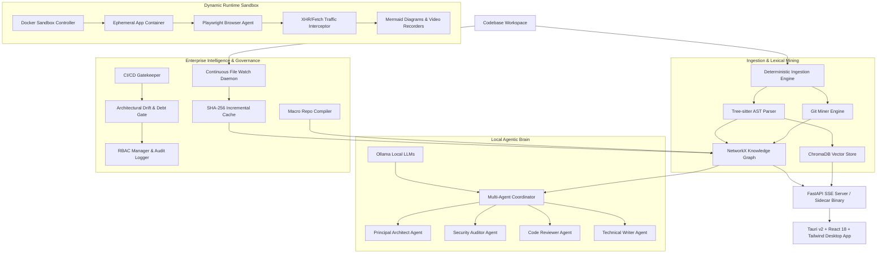

# Repollama 🦙🔍

**Repollama** is a local-first, privacy-focused, enterprise-grade **Autonomous Software Intelligence Platform** built from the ground up. It empowers software architects, security engineers, and developers to analyze, visualize, sandbox, audit, and govern codebases completely offline.

By combining deterministic Abstract Syntax Tree (AST) parsing, Git history mining, local NetworkX knowledge graphs, a ChromaDB vector store, secure Docker sandboxing, autonomous Playwright agents, a custom LLM Multi-Agent Framework, and continuous CI/CD governance checks, Repollama delivers a comprehensive developer cockpit directly in your terminal and on your desktop.

---

## 🏗️ Platform Architecture

Repollama leverages a decoupled, high-performance architecture merging static lexical code analysis with dynamic runtime exploration and local LLM intelligence:



---

## 💡 Core Capabilities

### 1. 📂 Ingestion & Repository Intelligence
Build a deep lexical and semantic understanding of codebases without sending a single byte outside your local network:
* **Multi-Language AST Parser**: Built on `tree-sitter` (supporting Python, JavaScript, TypeScript, and TSX) to extract function signatures, class hierarchies, and import dependencies.
* **Git History Miner**: Integrates with `GitPython` to quantify file churn rates, developer ownership, and temporal co-change patterns.
* **NetworkX Knowledge Graph**: Constructs a multi-relational code dependency graph connecting functions, classes, modules, and external libraries.
* **Vector Store & RAG**: Uses `ChromaDB` for local embedding storage, enabling secure natural language semantic code search.

### 2. 🐳 Dynamic Runtime Sandbox & Tracing
Explore runtime behavior beyond static code analysis:
* **Docker Sandboxing**: Ephemerally spins up application stacks inside isolated containers with automatic environment/stack detection.
* **Playwright Browser Agent**: Automates web app interactions, extracts interactive DOM elements, takes page screenshots, and records full UI walkthroughs (`.webm`).
* **Sequence Diagram Tracing**: Intercepts HTTP/XHR API traffic during user flows (filtering out noise like images and static assets) and dynamically synthesizes Mermaid sequence diagrams.

### 3. 🧠 Engineering Intelligence & Multi-Agent Audits
A private, cooperative AI brain orchestrates reviews, documentation, and audits:
* **Local Multi-Agent Framework**: Coordinates role-based LLMs running on Ollama (**Principal Architect**, **Security Auditor**, **Code Reviewer**, and **Technical Writer**).
* **Technical Debt Evaluator**: Calculates composite maintainability scores for every file based on coupling density, cyclomatic complexity, and Git churn.
* **Security & Performance Auditors**: Scans codebases via AST analysis for exposed secrets/high-entropy tokens, weak cryptographic algorithms, bloated functions, DB/ORM N+1 query loops, and unawaited async calls.
* **Automated System Documentation**: Automatically generates C4 Architecture diagrams, Entity-Relationship Diagrams (ERDs), and complete Markdown wikis enriched with live audit metrics.

### 4. 🛡️ Enterprise Intelligence & CI Governance
Built for enterprise scale, multi-repo projects, and compliance governance:
* **Continuous File System Daemon**: Watchdog service (`repollama watch`) that listens for file system changes and applies surgical graph updates.
* **Incremental SHA-256 Caching**: Hashes source code files to bypass unchanged files during re-indexing.
* **Macro Repo Compiler**: Merges individual repository knowledge graphs into macro-graphs, resolving cross-repository imports and external interfaces.
* **CI/CD Quality Gatekeeper**: Enforces strict architectural governance policies during PR checks (`repollama ci-check`). Features Role-Based Access Control (RBAC) for architect overrides and records all actions in an append-only JSONL audit log.

### 5. 🖥️ Tauri Desktop Cockpit & PyInstaller Sidecar
* **Modern React Dashboard**: Built with React 18, TypeScript, Tailwind CSS, Lucide Icons, Recharts, and TanStack Table.
* **Pre-Flight Health Onboarding**: Built-in environment wizard verifying Docker daemon status, Ollama availability, and API endpoints.
* **Interactive Knowledge Graph Viewer**: Canvas-rendered 2D visualization of NetworkX graphs with node search and node detail inspection.
* **Live SSE Terminal**: Displays real-time indexing logs and progress streamed directly over Server-Sent Events (SSE).
* **Standalone Sidecar Distribution**: Packages the Python backend into a single self-contained executable (`repollama-backend`) bundled directly inside the native Tauri app.

---

## 🎛️ CLI Command Reference

Repollama provides a Typer CLI (`repollama`) with interactive Rich-rendered console tables and visual output:

| Command | Arguments / Options | Description |
| :--- | :--- | :--- |
| `health` | None | Validates Docker daemon, Ollama service, and backend server connectivity. |
| `models` | None | Lists installed and available Ollama LLM models. |
| `parse` | `<file_path>` [`--json`] | Parses a source file using Tree-sitter and returns structured AST metadata. |
| `git` | `[repo_path]` | Mines Git history to output file churn, author contributions, and ownership metrics. |
| `index` | `[repo_path]` | Ingests workspace: parses AST, mines Git, populates ChromaDB, and builds knowledge graph. |
| `sandbox` | `[repo_path]` | Ephemerally containerizes and boots the project stack using Docker. |
| `browse` | `<url>` | Launches Playwright browser, navigates to target URL, extracts interactive components, and takes screenshot. |
| `trace` | `<url>` `<click_text>` | Simulates user click, intercepts backend network traffic, and constructs Mermaid sequence diagram. |
| `record` | `<url>` `<actions>` | Executes comma-separated user actions and records execution to `.webm` walkthrough video. |
| `audit` | `[repo_path]` | Runs local AI Multi-Agent Coordinator for architectural review and security auditing. |
| `debt` | `[repo_path]` | Calculates technical debt risk scores and displays interactive console heatmaps. |
| `scan` | `<repo_path>` | Scans for security vulnerabilities (exposed secrets, weak crypto) and performance bottlenecks. |
| `drift` | `[repo_path]` [`-b base`] [`-t target`] | Compares structural dependencies across Git commits to detect architectural drift. |
| `docs` | `<repo_path>` | Generates C4 system diagrams, database ERDs, and automated repository wikis. |
| `watch` | `[repo_path]` | Launches continuous filesystem daemon to apply surgical incremental graph updates via SHA-256 caching. |
| `macro` | `<repo_paths...>` | Merges multiple repositories into a unified macro knowledge graph and macro C4 diagram. |
| `ci-check`| `[repo_path]` [`-b base`] [`-t target`] [`-r role`] | Quality gate verifying PR drift and debt thresholds with RBAC checks and immutable audit logs. |
| `init-ci` | None | Outputs a pre-configured GitHub Actions workflow (`.github/workflows/repollama_gate.yml`). |

---

## 🚀 Getting Started

### Prerequisites
1. **Ollama**: Download and install [Ollama](https://ollama.com/) locally. Ensure the service is running (`ollama serve`).
2. **Node.js**: Version 18+ (for compiling the React frontend).
3. **Python**: Version 3.9+ with **Poetry** installed.
4. **Docker**: Docker Desktop or Docker Engine running (required for `sandbox` container execution).

---

### Step 1: Run the Backend API

1. Navigate to the backend directory:
   ```bash
   cd backend
   ```
2. Install Python dependencies using Poetry:
   ```bash
   poetry install
   ```
3. Launch the FastAPI development server:
   ```bash
   poetry run uvicorn repollama.main:app --reload
   ```
   *The FastAPI server will start on `http://127.0.0.1:8000`.*

---

### Step 2: Run the Desktop Frontend

1. Navigate to the frontend directory in a new terminal:
   ```bash
   cd frontend
   ```
2. Install Node dependencies:
   ```bash
   npm install
   ```
3. Launch the Tauri desktop app in development mode:
   ```bash
   npx tauri dev
   ```
   *This compiles the Rust harness, boots Vite development server, and opens the native application window.*

---

### Step 3: Bundle Standalone Sidecar & Executable

To package the Python backend into a standalone sidecar binary for native Tauri desktop distribution:

1. Build the standalone PyInstaller backend binary:
   ```bash
   cd backend
   poetry run pyinstaller --onefile --name repollama-backend repollama/main.py
   ```
2. Copy the executable to the Tauri sidecar target folder (`frontend/src-tauri/bin/` with target target triple suffix).
3. Build the native desktop app bundle:
   ```bash
   cd frontend
   npx tauri build
   ```

---

## 🧪 Running the Test Suite

Repollama includes comprehensive unit and integration test coverage for all parsers, graph engines, dynamic agents, CLI commands, and enterprise governance systems.

To execute the test suite:

```bash
cd backend
PYTHONPATH=. pytest
```

**Test Status**: `110 / 110 Passing Tests` ✅

---

## 📄 License

Distributed under the MIT License. See `LICENSE` for more information.
